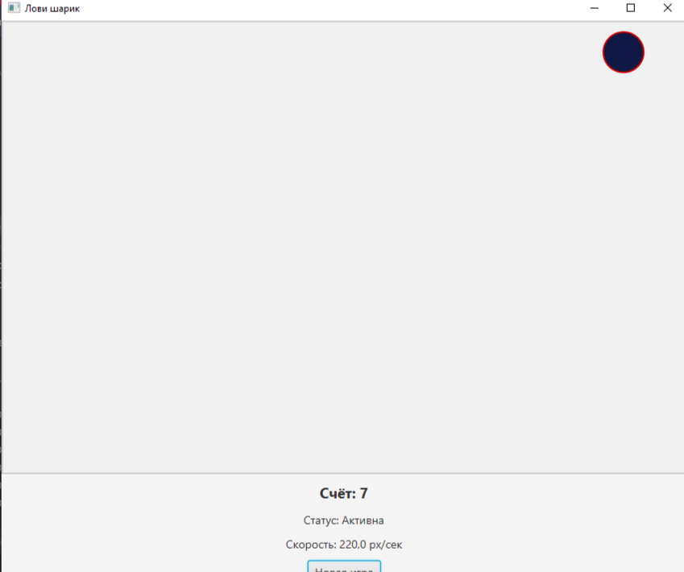

# 🎯 Игра «Лови шарик» (JavaFX)

## 📝 Описание

Это игра, в которой нужно кликать по движущемуся шарику, чтобы зарабатывать очки. Шарик "убегает" от курсора мыши, что усложняет игру. Проект разработан с использованием **событийно-ориентированного подхода** и архитектуры **MVVM** на **JavaFX**.

## ✨ Возможности игры

- 🏀 Шарик движется по игровому полю и отскакивает от границ
- 🖱️ **Одинарный клик** по шарику – +1 очко, шарик меняет цвет
- 🔄 **Двойной клик** по шарику – пауза / возобновление игры
- 🏃‍♂️ Шарик **убегает** от курсора мыши (индивидуальный вариант)
- 📊 Отображение счёта, статуса и текущей скорости
- ⚡ Каждые 5 попаданий скорость увеличивается на 10%
- 🎨 Случайная смена цвета шарика при попадании
- 🆕 Кнопка «Новая игра» для сброса всех параметров
- 📏 Адаптация к изменению размера окна

## 🎮 Управление

| Действие | Результат |
|----------|-----------|
| **Клик по шарику** | +1 очко, смена цвета |
| **Двойной клик по шарику** | Пауза / Возобновление |
| **Движение мыши к шарику** | Шарик убегает |
| **Кнопка «Новая игра»** | Сброс игры |

## 🏗️ Архитектура проекта

Проект построен по принципу **MVVM** (Model-View-ViewModel):
## Скриншот проекта

## Разработал студент группы зБИСТ - 231
## Полатай Виктор